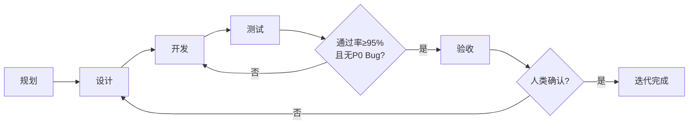
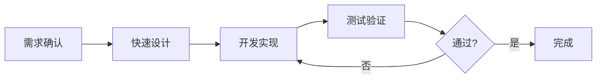
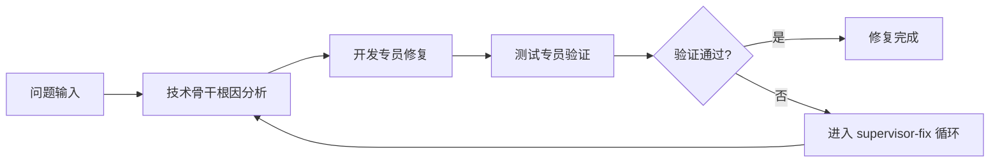
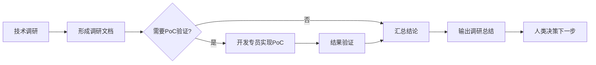
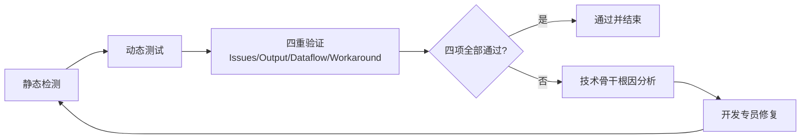
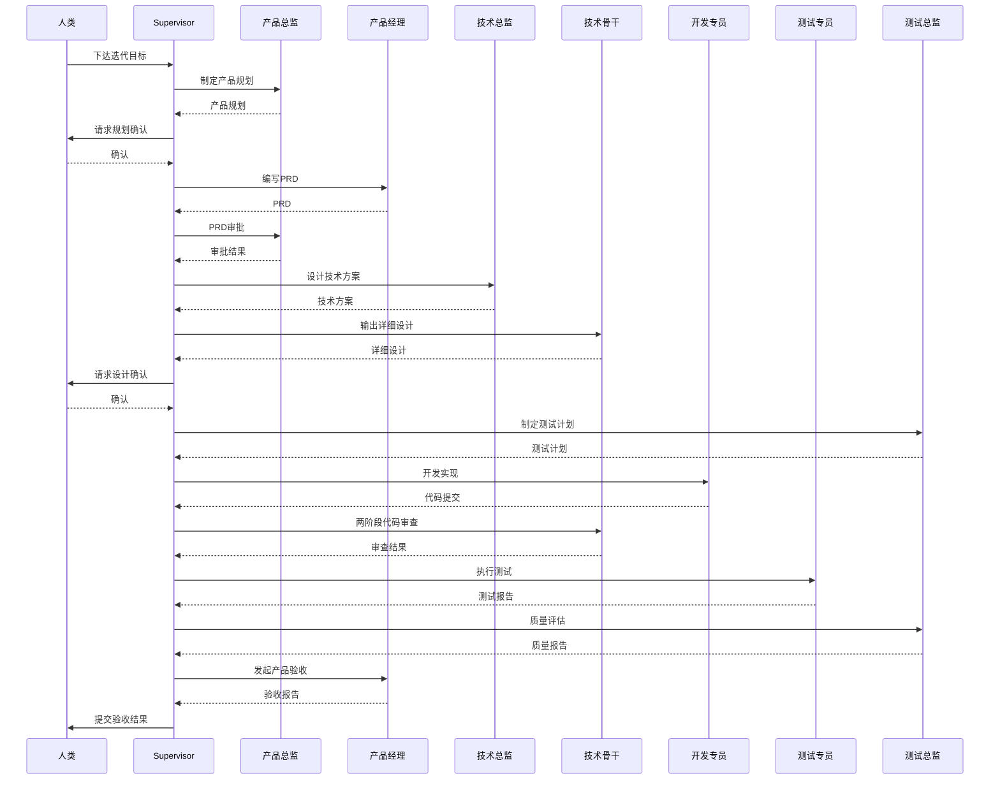

# Vibe — 多智能体产品迭代框架

面向通用 AI 编程环境的多智能体协作框架，通过角色分工自动驱动产品迭代流程（规划 → 设计 → 开发 → 测试 → 验收），在关键决策点保留人类审批。

## 架构概览

```
                    ┌─────────────────┐
                    │     人类决策    │
                    └────────▲────────┘
                             │
              ┌──────────────┴──────────────┐
              │                             │
              │      ┌────────▼────────┐    │
              │      │   Supervisor    │    │
              │      │  (Skill 调度)   │    │
              │      └────────┬────────┘    │
              │               │             │
    ┌─────────┴───────────────┴─────────────┴──────────┐
    │               核心执行 Agent 层                  │
    ├──────────────────────────────────────────────────┤
    │  产品线          │  技术线          │  测试线    │
    │  ┌────────────┐  │  ┌────────────┐  │ ┌────────┐ │
    │  │ 产品经理   │  │  │ 技术骨干   │  │ │测试专员│ │
    │  └────────────┘  │  └──────┬─────┘  │ └────────┘ │
    │                  │         ▼        │            │
    │                  │  ┌────────────┐  │            │
    │                  │  │ 开发专员   │  │            │
    │                  │  └────────────┘  │            │
    ├──────────────────────────────────────────────────┤
    │          按需调用（完整模式 / 升级时）           │
    │  ┌──────────┐  ┌──────────┐  ┌──────────┐        │
    │  │ 产品总监 │  │ 技术总监 │  │ 测试总监 │        │
    │  └──────────┘  └──────────┘  └──────────┘        │
    └──────────────────────────────────────────────────┘
```

## 核心特性

- **角色分工** — 7 个专业 Agent（产品总监、产品经理、技术总监、技术骨干、开发专员、测试总监、测试专员），职责明确、边界清晰
- **多种迭代模式** — 完整 / 快速 / 修复 / 探索，按需求规模选择最优流程
- **文档驱动协作** — 所有角色通过 `.vibe/docs/` 下的文档进行协作，全程可追溯
- **人类在环** — 关键节点（PRD 审批、架构决策、发布评估）自动暂停，等待人类决策
- **质量铁律** — 证据优先、根因优先、3 次失败升级、禁止 Workaround
- **自动调度** — Supervisor 根据 Agent 返回的结构化 JSON 自动推进流程

## 迭代模式

| 模式 | 适用场景 | 流程 |
|------|----------|------|
| **完整模式** | 新功能、大重构 | 规划 → 设计 → 开发 → 测试 → 验收 |
| **快速模式** | 小需求、UI 调整 | 设计 → 开发 → 测试 |
| **修复模式** | Bug 修复 | 分析 → 修复 → 验证 |
| **探索模式** | 技术调研 | 调研 → 验证 → 总结 |

## 流程图示（Mermaid）

### 完整模式流程（规划→设计→开发→测试→验收）



### 快速模式流程（设计→开发→测试）



### 修复模式流程（分析→修复→验证）



### 探索模式流程（调研→验证→总结）



### 测试-修复闭环（supervisor-fix）



### 关键协作时序图（完整模式）



## 项目结构

```
vibe/
├── agents/                     # Agent 定义（YAML frontmatter + 角色提示词）
│   ├── 产品总监.md
│   ├── 产品经理.md
│   ├── 技术总监.md
│   ├── 技术骨干.md
│   ├── 开发专员.md
│   ├── 测试总监.md
│   └── 测试专员.md
│
├── skills/                     # Skill 定义（可复用能力模块）
│   ├── supervisor/             # 主调度逻辑
│   ├── supervisor-fix/         # 测试-修复循环
│   ├── developer/              # 开发工作流
│   ├── tester/                 # 测试工作流
│   ├── product-manager/        # 产品管理
│   ├── product-director/       # 产品战略
│   ├── tech-director/          # 架构决策
│   ├── tech-lead/              # 技术分析
│   ├── test-director/          # 测试策略
│   ├── command-executor/       # 命令执行防阻塞
│   ├── shared/                 # 共享原则
│   └── templates/              # 文档模板

```

## 快速开始

### 前置要求

- 已配置支持 Agent / Skill 调度的 AI 编程环境
- 具备可访问项目工作区的终端能力（用于执行构建、测试、验证命令）

### 使用方式

**方式：Skill 调度**

1. 在 `.vibe/docs/迭代计划.md` 中写明迭代目标和任务
2. 在你的 AI 编程环境中调用 Supervisor Skill 启动调度
3. Supervisor 自动按流程调用各角色 Agent 执行任务
4. 在人类决策点进行审批或调整

## 角色说明

| 角色 | 职责 | 调用时机 |
|------|------|----------|
| **Supervisor** | 调度 Agent、推进流程 | 始终 |
| **产品经理** | 编写 PRD、产品验收 | 设计 / 验收阶段 |
| **技术骨干** | 详细设计、疑难排查、代码审查 | 设计 / 开发 / 修复阶段 |
| **开发专员** | 编码实现、单元测试、Bug 修复 | 开发 / 修复阶段 |
| **测试专员** | 测试用例、执行测试、提交 Bug | 测试 / 修复阶段 |
| **产品总监** | 产品规划、审批 PRD | 仅完整模式规划阶段 |
| **技术总监** | 架构设计、技术选型 | 仅完整模式 + 架构升级 |
| **测试总监** | 测试策略、发布质量评估 | 仅完整模式测试阶段 |

## 文档产出清单（基于 skills）

以下为流程中**可能产生**的文档（按角色分为：总体 / 产品 / 开发 / 测试）：

### 总体

| 文档 | 路径 | 主要产出角色 | 触发场景 | 说明 |
|------|------|--------------|----------|------|
| 迭代计划 | `.vibe/docs/迭代计划.md` | Supervisor | 启动任意迭代模式 | 记录目标、阶段、任务分配、阻塞与下一步 |
| 决策记录 | `.vibe/docs/决策记录.md` | Supervisor | 人类在环决策节点 | 记录审批/取舍/结论，便于追溯 |
| 进度总览 | `.vibe/docs/进度总览.md` | Supervisor（各角色协作更新） | 全流程 | 统一任务状态、审批队列、协作交接 |
| 调研总结 | `.vibe/docs/调研总结.md` | Supervisor（汇总） | 探索模式 | 汇总技术调研与 PoC 结论，供人类决策 |

### 产品

| 文档 | 路径 | 主要产出角色 | 触发场景 | 说明 |
|------|------|--------------|----------|------|
| 产品规划 | `.vibe/docs/产品规划.md` | 产品总监 | 完整模式规划阶段 | 定义愿景、目标、里程碑 |
| 需求优先级 | `.vibe/docs/需求优先级.md` | 产品总监 | 规划或需求调整 | 对需求按价值/成本排序 |
| PRD | `.vibe/docs/prd/{功能}.md` | 产品经理 | 设计阶段 | 功能需求、用户故事、验收标准 |
| 产品评审意见 | `.vibe/docs/reviews/产品评审-{功能名}.md` | 产品总监 | PRD 审批 | 给出通过/修改/拒绝结论 |
| 验收报告 | `.vibe/docs/验收报告.md` | 产品经理 | 验收阶段 | 按验收标准记录通过项与遗留项 |

### 开发

| 文档 | 路径 | 主要产出角色 | 触发场景 | 说明 |
|------|------|--------------|----------|------|
| 技术方案 | `.vibe/docs/技术方案.md` | 技术总监 | 设计阶段 | 架构设计、技术选型、核心流程、风险 |
| 代码规范 | `.vibe/docs/代码规范.md` | 技术总监 | 架构/规范建设 | 统一编码标准与审查依据 |
| 技术评审意见 | `.vibe/docs/reviews/技术评审-{功能名}.md` | 技术总监 | PRD 技术评审 | 评估可行性、工作量与技术风险 |
| 详细设计 | `.vibe/docs/design/{模块}.md` | 技术骨干 | 设计或开发前 | 模块职责、接口、数据结构、核心逻辑 |
| 代码审查报告 | `.vibe/docs/reviews/代码审查-{模块名}.md` | 技术骨干 | 开发阶段代码审查 | 两阶段审查（规格合规 + 质量）结论 |
| 疑难问题记录 | `.vibe/docs/疑难问题.md` | 技术骨干（可由技术总监补充决策） | 疑难问题升级 | 记录问题、已尝试分析、待决策事项 |
| 问题跟踪 | `.vibe/docs/问题跟踪.md` | 开发专员 / 测试专员 / 技术骨干 | 修复模式与日常缺陷流转 | 统一管理求助、根因分析、修复与验证状态 |
| 经验库 | `.vibe/docs/经验库.md` | 技术骨干 | 疑难排查后沉淀 | 积累踩坑经验与复用检查要点 |
| 常见问题检查清单（项目内副本） | `.vibe/docs/常见问题检查清单.md` | 技术骨干 | 发现新高频问题模式 | 沉淀 API/环境变量/端口/脚本等高频排查项 |
| 技术调研文档 | `.vibe/docs/技术调研-*.md` | 技术骨干 | 探索模式调研 | 记录候选方案、验证过程、结论 |

### 测试

| 文档 | 路径 | 主要产出角色 | 触发场景 | 说明 |
|------|------|--------------|----------|------|
| 测试计划 | `.vibe/docs/测试计划.md` | 测试总监 | 开发后进入测试前 | 定义测试范围、策略、资源与发布标准 |
| 测试用例 | `.vibe/docs/testcase/{功能}.md` | 测试专员 | 测试阶段 | 场景化用例、步骤、预期、优先级 |
| 用例审核意见 | `.vibe/docs/reviews/用例审核-{功能名}.md` | 测试总监 | 用例评审 | 审核覆盖度与可执行性 |
| 测试报告 | `.vibe/docs/测试报告.md` | 测试专员 | 每轮测试执行后 | 记录通过/失败/阻塞、新增 Bug |
| 质量标准 | `.vibe/docs/质量标准.md` | 测试总监 | 质量体系建设 | 定义发布门禁和质量阈值 |
| 质量报告 | `.vibe/docs/质量报告.md` | 测试总监 | 测试阶段收尾 | 基于测试结果给出发布建议 |
| 待验收清单 | `.vibe/docs/待验收.md` | 测试专员 | 测试完成后移交 | 通知产品经理发起验收 |
| 测试流程文档 | `docs/测试流程/{功能名}.md` | supervisor-fix（流程管理） | 自动化测试-修复闭环 | 复用已验证测试步骤，减少重复探索 |

> 说明：`skills/templates/通用模板.md` 提供了「版本化报告」「复盘报告」「计划/任务列表」三类通用结构；上述文档可按角色必填字段进行裁剪。

## 核心原则

**流程与行为（铁律）**

1. **证据优先于声明** — 任何完成声明必须有新鲜的验证证据，禁止"已完成""应该没问题"
2. **根因优先于修复** — 未找到根因前不得提出修复方案，禁止猜测修复
3. **3 次失败质疑架构** — 同一问题修复 3 次仍失败 → 立即停止 → 升级上报
4. **禁止 Workaround** — 不创建空文件、不注释测试、不硬编码绕过

**设计原则（API 与代码）**

5. **参数默认即是最优** — 默认值即推荐用法，零配置即可用对
6. **接口命名意图驱动** — 命名表达做什么、解决什么问题，不暴露实现细节
7. **大声报错，且自带解药** — 错误明确可定位，并附带可执行建议或排查指引

### 升级路径

```
开发专员 → 技术骨干 → 技术总监 → 人类
测试专员 → 测试总监 → 人类
产品经理 → 产品总监 → 人类
```

## 定制

- **添加角色**：在 `agents/` 下新建 `.md` 文件，配置 YAML frontmatter（name / model / tools / agentMode）
- **添加 Skill**：在 `skills/` 下新建目录，编写 `SKILL.md` 定义工作流
- **调整流程**：修改 `skills/supervisor/SKILL.md` 中的阶段定义和调度逻辑

## License

MIT
